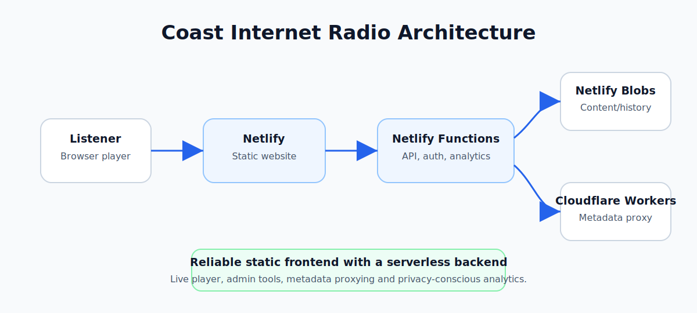

# Coast Internet Radio

[](https://github.com/JamieP-205/coast-internet-radio/actions/workflows/ci.yml)

## Live site

The production website is at [coastinternetradio.com](https://coastinternetradio.com/). The public site provides the player, metadata and listener‑facing pages. A separate admin area is protected behind authentication and is not part of the public demo.

## Status

**Live production project** – this site serves real listeners every day. Changes are tested thoroughly before deployment.

## Summary

I built and maintain this website for Coast Internet Radio. The project combines a listener‑focused public site with a private content editor, live programme information, first‑party analytics, feedback management and playlist history. It is designed for reliability: no client framework, minimal dependencies, and a serverless backend built around Netlify Functions and Cloudflare Workers.

## Architecture diagram

Below is a simplified view of the production architecture. A listener’s browser requests the static site from Netlify. The UI calls Netlify Functions to fetch programme metadata, submit feedback, record analytics and manage content. Netlify Blobs persists playlists, feedback, analytics and page content. Cloudflare Workers act as HTTPS‑friendly proxies to the station’s existing stream and metadata source.

| Coast architecture |
| --- |
|  |

## Demo note

The public site is fully accessible at the link above, but the admin area is private because it manages real station content, analytics and feedback. The repository includes reference implementations of the serverless functions and workers for review.

## What I built

- A responsive live‑radio player with now‑playing, coming‑up and recent‑track information
- Programme‑aware presentation for live shows, repeats and automated music
- A private admin area for content management, analytics, feedback, and playlist history
- Netlify Functions for authentication, managed content, analytics, feedback, play history and live status
- Netlify Blobs as the persistent store for playlists, listener events and content data
- Cloudflare Workers that bridge the station’s existing stream and metadata services to HTTPS
- A browser‑based “Station Helper” to answer common listener questions
- Accessibility controls for colour theme, text size, contrast and reduced motion

## Key files

- `index.html` – public listener homepage and player
- `src/css/` and `styles.css` – maintainable CSS source and generated production stylesheet
- `script.js` and `live-ui.js` – player controls, metadata polling, forms and shared rendering
- `managed-content.js` – public managed‑content loader
- `admin/` – authenticated screens for content, history, analytics and feedback
- `netlify/functions/` – serverless API and scheduled functions
- `workers-reference/` – source references for the deployed Cloudflare Workers
- `tools/` – build and validation scripts used in CI

## Technical approach

The listener experience uses semantic HTML, modular CSS and vanilla JavaScript to keep the UI fast and dependable. Netlify Functions own the server‑side work: signed admin sessions and password verification, managed homepage content, playlist and listener history, first‑party anonymous analytics, visitor feedback and safe public live‑status responses. Data lives in Netlify Blobs and Cloudflare Workers provide HTTPS‑compatible routes for the existing radio stream and metadata source. CI runs build, syntax and deployment‑structure checks on every push.

## Local development

```bash
npm ci
npm run check
npx netlify dev
```

`npm run check` rebuilds the CSS bundle, validates the deployment structure, checks JavaScript syntax, validates JSON and verifies local HTML references with exact filename casing.

## Privacy & security notes

I designed the analytics system to avoid third‑party tracking. It uses allowlisted events, does not store raw IP addresses and keeps detailed data retention rules in the application logic. The admin area uses signed `HttpOnly` sessions, same‑origin checks, CSRF protection for sensitive actions, environment‑based secrets and protected diagnostic routes. Credentials and production data are never stored in this repository. See [SECURITY.md](SECURITY.md) for the full security policy.

## What I learned

Building a production site for a real radio station taught me how to balance simple technologies with robust serverless backends. I gained experience in authenticating admin users without exposing secrets, designing privacy‑respecting analytics, modelling live content and programme schedules, and handling Netlify Blobs and Cloudflare Workers in tandem. I also learned how to document and maintain a project that runs 24/7.

## Future improvements

- Improve the player experience on low‑bandwidth connections
- Add automated end‑to‑end tests for the admin area
- Explore exposing limited public playlists via RSS or JSON feeds
- Continue refining analytics dashboards to highlight listener trends while respecting privacy

For changelog entries, testing checklists and contribution guidance, see the other documentation in this repository.

