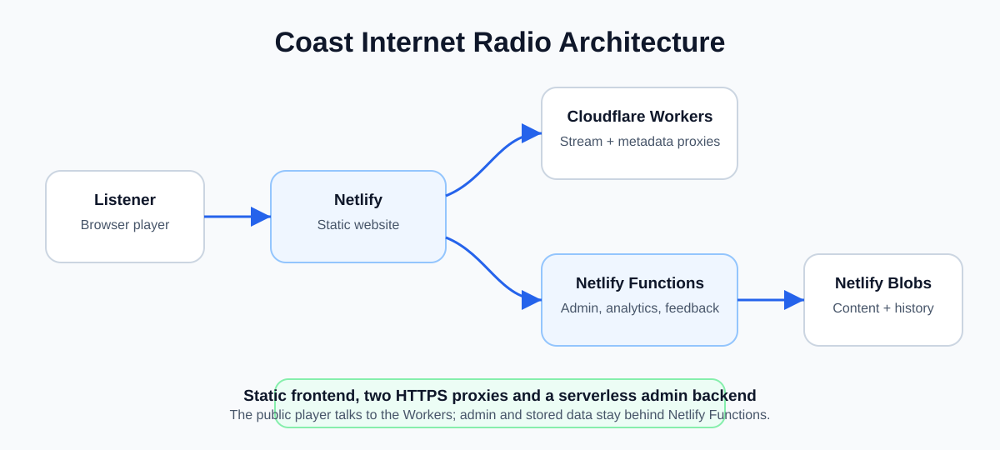

# Coast Internet Radio

[](https://github.com/JamieP-205/coast-internet-radio/actions/workflows/ci.yml)

Live at [coastinternetradio.com](https://coastinternetradio.com/).

The website for Coast Internet Radio, a small station in Newry run by Jim Parr. It has real listeners every day, so this repo is not a demo. I build it, I maintain it, and if I break it somebody rings me.

## The thing that shapes everything else

The station's audio stream and its now-playing feed are both served over plain HTTP. The website is HTTPS. Browsers block that as mixed content, so the player will not play, and no amount of front-end work changes it.

Two Cloudflare Workers sit in front of the station's source and re-serve the stream and the metadata over HTTPS. The site only ever talks to the workers. The source for both is in [`workers-reference/`](workers-reference/), which is a copy for review, not what is deployed.



## What is in it

- A live player with now playing, coming up and recently played, polled every ten seconds
- Media Session support, so the phone lock screen controls work like a radio app
- An admin area where Jim edits the homepage, reads listener feedback and looks at play history, without needing me
- First-party analytics, written rather than installed. Basic events are anonymous; opting in adds a random returning-visitor ID. Raw IP addresses are not stored
- A Station Helper that answers common listener questions from a JSON knowledge base
- Display preferences for theme, text size, contrast and motion, applied before first paint

The admin area is not public, because it manages a real station's content and a real audience's feedback. The functions behind it are all in this repo if you want to read them.

## Files

- `index.html` the listener homepage
- `src/css/*.css` the actual stylesheet source
- `styles.css` **generated**, do not edit it by hand
- `script.js` player, metadata polling, preferences, request form
- `netlify/functions/` the API, admin auth, analytics, feedback, play history
- `workers-reference/` copies of the two Cloudflare Workers
- `tools/` everything CI runs
- `admin/` the private screens

## Running it

```bash
npm ci
npm run check
npx netlify dev
```

`npm test` runs those checks plus the unit tests.

## Gotchas

- **`styles.css` is generated** from `src/css/*.css` by `tools/build-css.js`. Edit a partial, not the bundle, or your change disappears on the next build.
- **Inline scripts are allowed by sha256 hash** in `_headers`, not by `unsafe-inline`. If you edit one, its hash changes and the browser will silently block it in production. `npm run check` recomputes every hash and fails the build with the value you need, which is the whole reason that check exists: it had already drifted once, and the theme script was being blocked live before I caught it.
- **`now-playing.json` is a local preview file only.** It is never used on the deployed site. If you wire it in, listeners get stale song titles.
- **Do not point the player at the station's origin.** It is HTTP, and it will fail on HTTPS.

## Security and privacy

Admin sessions are signed HttpOnly cookies, passwords are hashed with scrypt, writes carry a CSRF token, requests are same-origin checked, and repeated failed logins lock the address out. Analytics never store a raw IP address. Secrets live in Netlify environment variables and are not in this repo. Reporting is in [SECURITY.md](SECURITY.md).

## AI-assisted security work

I used AI tooling while working through the security-sensitive parts of this site: signed admin sessions, scrypt password hashing, CSRF and same-origin checks, CSP hashes, and the focused tests around them. I reviewed the behaviour against those tests before deploying it.

## Known limitations

- No end-to-end tests for the admin area, so I still click through it by hand before a deploy, which is exactly the kind of thing that gets skipped when I am tired
- Analytics aggregate on read. Fine at this size, will not stay fine if the station grows
- The site depends on the two workers being up, and they are outside this repo

Dated change history is in [CHANGELOG.md](CHANGELOG.md), the manual release checks are in [TESTING_CHECKLIST.md](TESTING_CHECKLIST.md), and project rules are in [CONTRIBUTING.md](CONTRIBUTING.md).
